Context:
--
GCP exams focus more on how to develop and implement comprehensive solutions than knowing minutia of the services. The goal of this project is to connect services together into a comprehensive solution. Plus, the end result kinda cool.


Scope
--
Create a cloud storage bucket
Create a cloud function with this code. This code will take any image file from the bucket, and submit it to Google's Machine Learning APIs.
Configure the cloud function to trigger when a file is uploaded to the bucket (This is the trigger to look into: google.storage.object.finalize)
Optional: Create a cloud datastore table where the results of the API call can be written. (There is no code for this- its optional, so it should be a bit less plug and play- this is a chance to get more familiar with GCP's SDKs, which, while not a major component of the exam, are extremely important for practicing DevOps in the environment)

The solution should include the following GCP services:

- Cloud Storage Buckets
- Cloud Function
- Cloud Vision API

Steps:
--

1. Create a new bucket. Since this is a learning exercise, which type of bucket should we use?

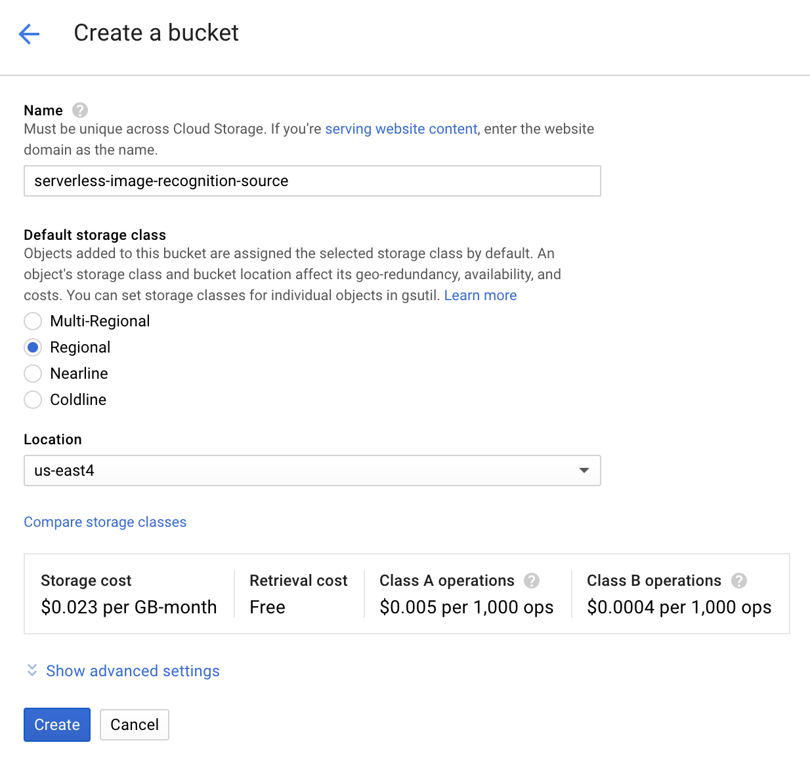

2. Go to `Cloud Functions` in the console.

3. Click `+ Create Function`

4. After naming the function (and leave memory allocation at the default 256 MB), adjust the trigger. By default, it's set to `HTTP`, but we will change that to `Cloud Storage`. The `Event Type` will default to `Finalize/Create`, which is what we want for this project. Take a look at the other trigger event options. What are some use cases for those functionalities?  
Select the bucket created in set 1 as the `Bucket`, leave the `Source code` set to `inline editor` - we will be adding that shortly. Finally, change the `Runtime` to `Python 3.7`. It is currently in beta, which is fine for our purposes.

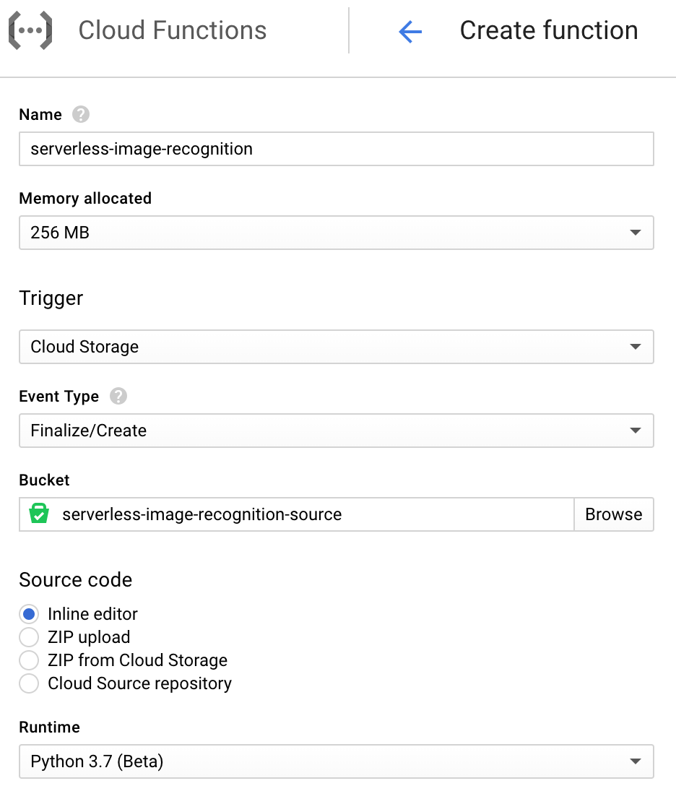

5. Scroll down to the lower half of the page. You will see some prebuilt code. We won't be using it. Before just copying and pasting from this repo, though, lets take a look at the code and talk about the services being used.

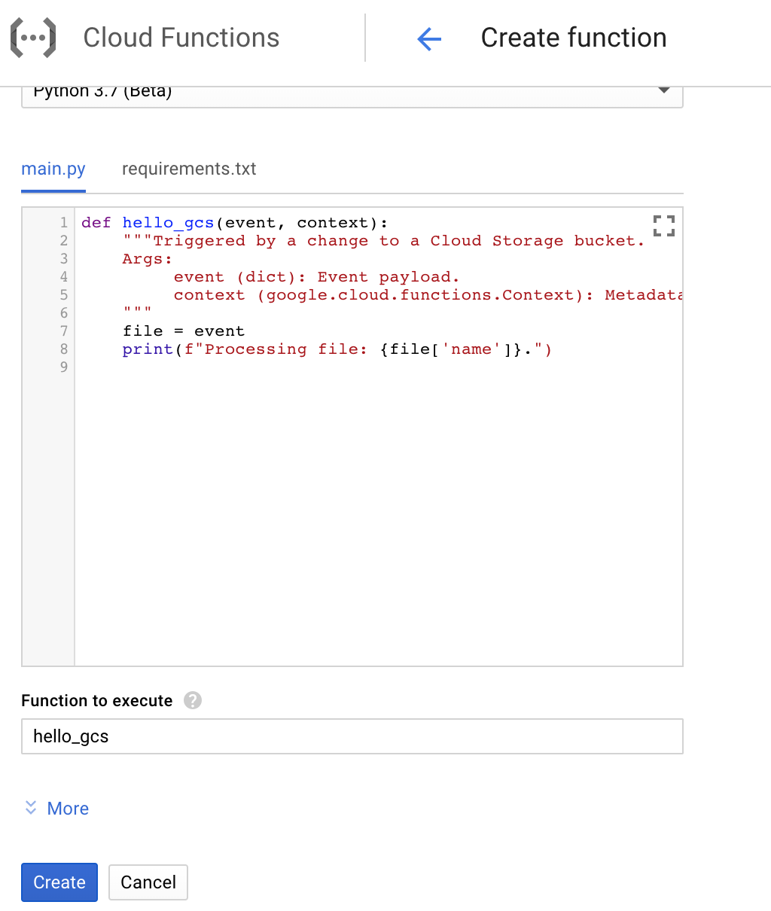

In the `function.py` in this repo, take a look at the code. The GCP exams don't require a deep understanding of code, but there are some snippets of python, so some familiarity will be helpful.

Lines 3-5
```
from google.cloud import storage
from google.cloud import vision
from google.cloud.vision import types
```

Import the Google Cloud SDKs. Make sure that any modules you would have to `pip install` (non native modules) are also noted in `requirements.txt`. This tells the Cloud Function which modules it needs to import. :
```
# Function dependencies
google-cloud-storage
google-cloud-vision
```


The first function pulls the object from the bucket into the cloud function compute space. It's worth noting that you can read and write objects into the `/tmp` directory of a cloud function, but that will not persist past the run of the function, so make sure anything you want to keep is written out to a bucket. You can see more about the code [here](https://cloud.google.com/storage/docs/downloading-objects#storage-download-object-python).
```
def download_blob(bucket_name, source_blob_name, destination_file_name):
    """Downloads a blob from the bucket."""
    storage_client = storage.Client()
    bucket = storage_client.get_bucket(bucket_name)
    blob = bucket.blob(source_blob_name)

    blob.download_to_filename(destination_file_name)

    print('Blob {} downloaded to {}.'.format(
        source_blob_name,
        destination_file_name))

    return destination_file_name
```

The second function makes the call to the cloud vision API. You'll notice all we are doing with the results is printing them. We'll talk more about this later. You can see more about the code [here](https://cloud.google.com/vision/docs/quickstart-client-libraries#using_the_client_library).
```
def detect_labels(destination_file_name):

    # Instantiates a client
    client = vision.ImageAnnotatorClient()

    # The name of the image file to annotate
    file_name = destination_file_name

    # Loads the image into memory
    with io.open(file_name, 'rb') as image_file:
        content = image_file.read()

    image = types.Image(content=content)

    # Performs label detection on the image file
    response = client.label_detection(image=image)
    labels = response.label_annotations

    print('Labels:')
    for label in labels:
        print(label.description)
```

6. Copy the code from `function.py` to the `main.py` tab and the `requirements.txt` to that tab.

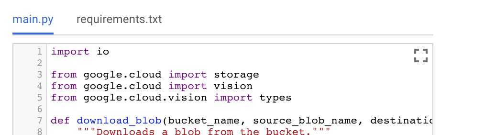

7. Change the `function to execute` from `hello_gcs` to `analyze_image`. This tells the cloud function what function it is actually going to run. Create the function, it will take a few minutes to create.

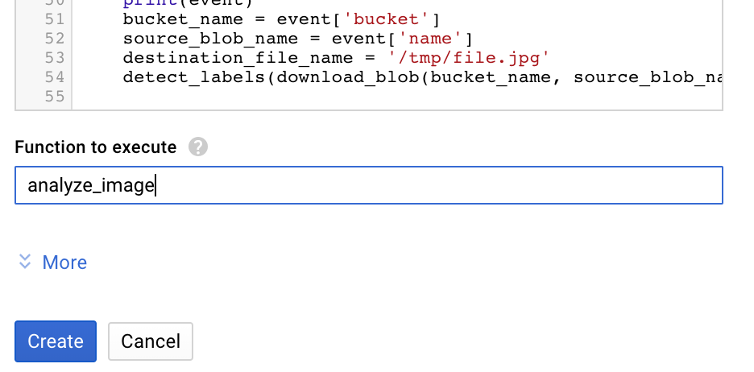

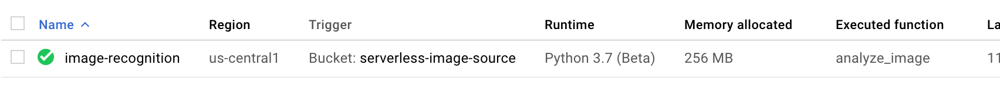

8. While that function is deploying, we have to enable the Cloud Vision API. Go to the `API Library` in the `APIs and Services` section of the menu.

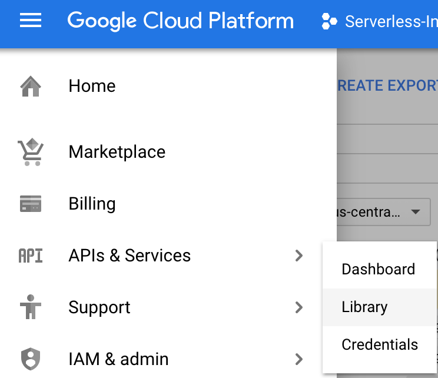

9. Search for `cloud vision`.

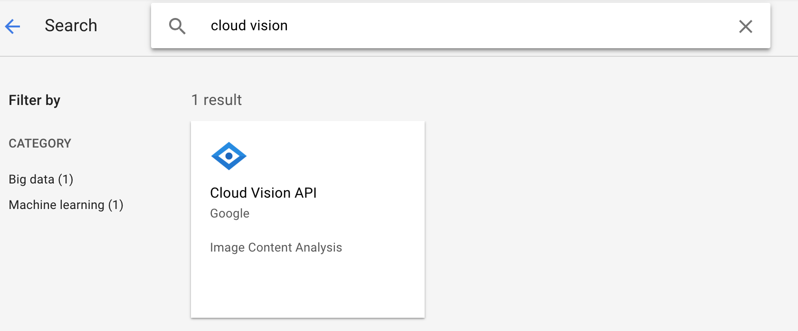

10. Click to Enable API.

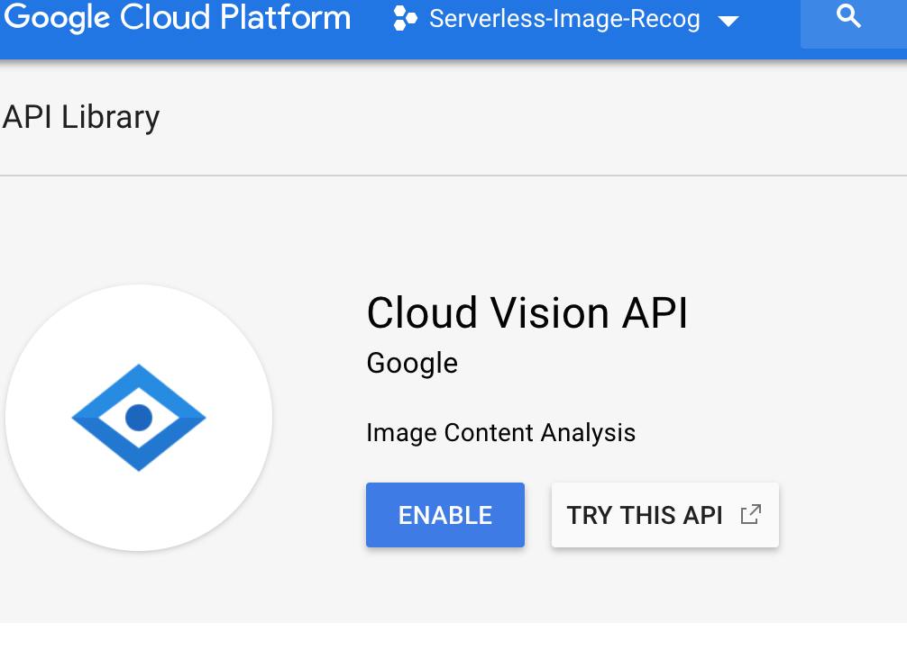

11. Now that the function is deployed, let's try it out. I found an image of some cute iguanas:

(source: https://www.theguardian.com/news/gallery/2018/nov/08/baby-iguanas-diwali-lights-thursdays-best-photos)

 I will drop this in my bucket through the console.

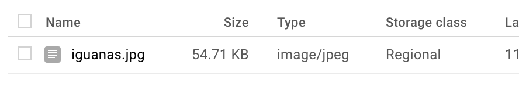

12. Since we printed the code, we can just check the console output. In Cloud Functions, these logs are aggregated in Stackdriver. You can get to the logs by clicking on `view logs` at the top of the of the Cloud Function details page:

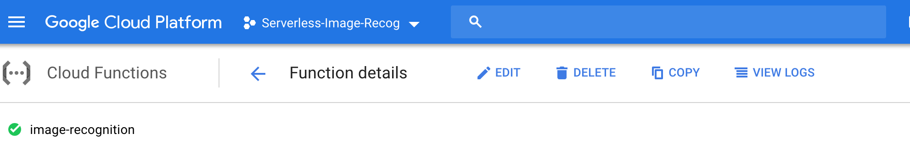

13. Your logs should look something like this. Obviously, the results under `Labels` will vary depending on the image you upload.

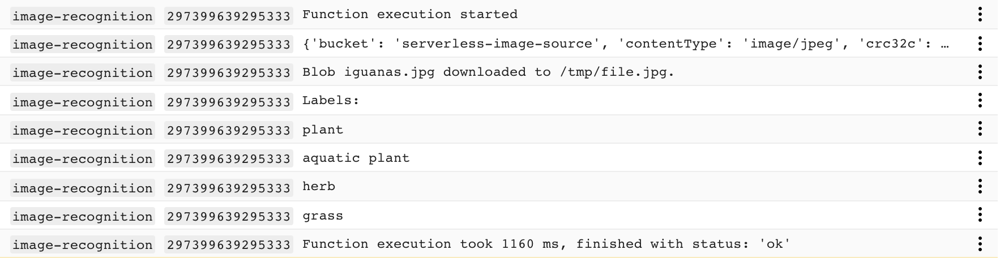

Bonus: Right now, we're just looking at the results in Stackdriver, but what else could we do with them? Try updating the cloud function code to write the results to a pub/sub topic or a datastore database. 
